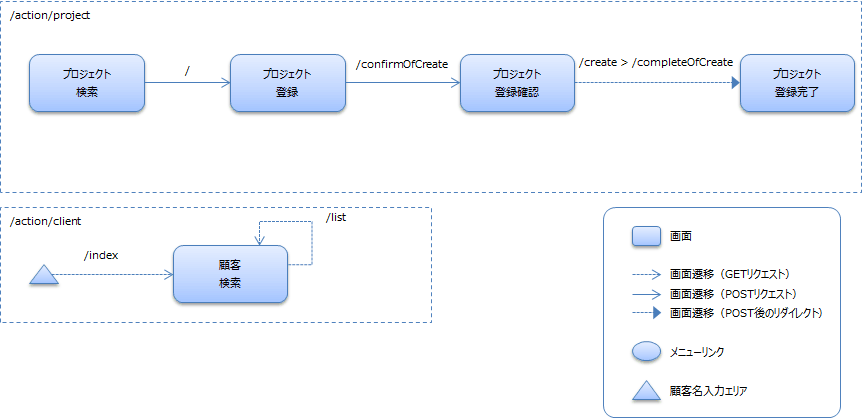
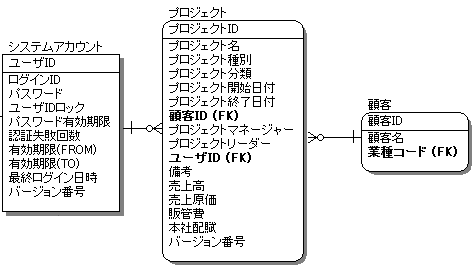

登録画面を作ろう
==================================

## 演習内容
本ハンズオンでは、マスタメンテでよく扱う登録処理の作り方を学習します。
ウェブExampleアプリケーションのプロジェクト新規登録機能を題材にします。

基本編では、入門編で学んだことを踏まえつつ、Nablarchの解説書を参照しながら機能を作りこんでいきます。

## 作成する機能について

プロジェクト登録機能を作成します。

## 演習を開始する為の準備

### 事前準備

#### データベース・エンティティクラスの準備
本ハンズオンを開始する前にデータベースの作成及びエンティティクラスの生成を行っていない(以下のコマンドを実行していない)場合、チェックアウトディレクトリに移動し、以下のコマンドを実行してください。

    $cd entity
    $mvn clean install

#### ウェブアプリケーション共通ライブラリの準備
本ハンズオンを開始する前にウェブアプリケーション共通ライブラリの作成を行っていない(以下のコマンドを実行していない)場合、チェックアウトディレクトリに移動し、以下のコマンドを実行してください。

    $cd nablarch-handson-app-web-common
    $mvn clean install

### web プロジェクト起動
チェックアウトディレクトリに移動し、以下のコマンドを実行してください。ブラウザが自動的に起動します。
正常に「ログイン画面」が表示されることを確認してください。

    $cd handson-09
    $mvn clean compile
    $mvn waitt:run

## 演習内容に関するリファレンスマニュアル
本演習中に実装方法で不明な点が存在した場合は、以下のドキュメントを参照してください。

- 入門編で参照したドキュメント全般

### 解説書

#### Nablarchアプリケーションフレームワークの解説書
2.2と7.10.1の「データベースとの相関バリデーションを行う」を読むことで、どの精査をFormで行い、どの精査をActionで行うかがわかります。また、7.10.1の「相関バリデーションを行う」を読むことで、Formで行う相関バリデーションの実装方法がわかります。

- [2.2. アプリケーションの責務配置](https://nablarch.github.io/docs/5u23/doc/application_framework/application_framework/web/application_design.html#application-design)
- [7.10.1. Bean Validation](https://nablarch.github.io/docs/5u23/doc/application_framework/application_framework/libraries/validation/bean_validation.html#bean-validation)
	- [相関バリデーションを行う](https://nablarch.github.io/docs/5u23/doc/application_framework/application_framework/libraries/validation/bean_validation.html#bean-validation-correlation-validation)
	- [データベースとの相関バリデーションを行う](https://nablarch.github.io/docs/5u23/doc/application_framework/application_framework/libraries/validation/bean_validation.html#bean-validation-database-validation)

### APIドキュメント(アプリケーションプログラマ向け)
- [UniversalDao](https://nablarch.github.io/docs/5u23/publishedApi/nablarch-all/publishedApiDoc/programmer/nablarch/common/dao/UniversalDao.html)
    (レコードの存在チェックに使用できるメソッドが記載されています)
- [DateUtil](https://nablarch.github.io/docs/5u23/publishedApi/nablarch-all/publishedApiDoc/programmer/nablarch/core/util/DateUtil.html)
	(相関バリデーション実施時に、プロジェクト開始日とプロジェクト終了日が正しく入力されているか確認する際とDate型に変換する際に使用します)
- [StringUtil](https://nablarch.github.io/docs/5u23/publishedApi/nablarch-all/publishedApiDoc/programmer/nablarch/core/util/StringUtil.html)
	(相関バリデーション実施時に、プロジェクト開始日とプロジェクト終了日が入力されているか確認する際に使用します)

## 実装する機能
ユーザの入力を元に、新しいプロジェクトを登録する機能を実装してください。挿入先のテーブルはPROJECTテーブルになります。
入力項目については、提供するJSPを参照してください。

## 画面遷移
画面遷移は以下の通りにしてください。

### 画面遷移(戻り遷移は除く)

### 画面遷移(戻り遷移のみ)

## ER図
本ハンズオンで使用するテーブルのER図です。

## 実装済みの箇所
### 画面(Java側、JSP側双方含む)
以下の画面については実装済みです。

- プロジェクト検索
- 顧客検索

### JSPファイル
JSPファイルは実装済みです。以下のファイルを使用してください。

- プロジェクト登録画面([create.jsp](./src/main/webapp/WEB-INF/view/project/create.jsp))
- プロジェクト登録確認画面([confirmOfCreate.jsp](./src/main/webapp/WEB-INF/view/project/confirmOfCreate.jsp))
- プロジェクト登録完了画面([completeOfCreate.jsp](./src/main/webapp/WEB-INF/view/project/completeOfCreate.jsp))

## 仕様について

### 画面間の連携に関する仕様
#### ログインユーザのIDについて
- ログインユーザのIDはセッションストアで保持しています。セッションストアへ登録する処理は、ログイン処理([AuthenticationAction#login](./src/main/java/com/nablarch/example/app/web/action/AuthenticationAction.java))で行っています。

#### 画面から送信される値及び、画面表示する値に関するFormとDTOの利用ルール
- 以下の値の連携は、Formを使用して連携してください。
    - プロジェクト登録画面([create.jsp](./src/main/webapp/WEB-INF/view/project/create.jsp))から、プロジェクト登録情報確認画面の表示処理([ProjectAction#confirmOfCreate](./src/main/java/com/nablarch/example/app/web/action/ProjectAction.java))へ送信された値の取り出しは、プロジェクト登録Form([ProjectForm](./src/main/java/com/nablarch/example/app/web/form/ProjectForm.java))を使用してください。

- 以下の値の連携は、DTOを使用してください。
    - プロジェクト登録画面([create.jsp](./src/main/webapp/WEB-INF/view/project/create.jsp))へ戻る処理([ProjectAction#backToNew](./src/main/java/com/nablarch/example/app/web/action/ProjectAction.java))で表示する値は、プロジェクト情報DTO([ProjectDto](../nablarch-handson-app-web-common/src/main/java/com/nablarch/example/app/web/dto/ProjectDto.java))を介して設定してください。

#### セッションストアを用いた値の連携を使用する箇所
以下の値の連携は、セッションストア上のProjectのエンティティを介して行ってください。セッションストアに登録する際のキー名は"project"としてください。

| 遷移元 | 遷移先 |
|:-------|:-------|
| プロジェクト登録確認画面([confirmOfCreate.jsp](./src/main/webapp/WEB-INF/view/project/confirmOfCreate.jsp)) （セッションストアへの値の登録自体は、登録情報確認画面表示処理([ProjectAction#confirmOfCreate](./src/main/java/com/nablarch/example/app/web/action/ProjectAction.java))で実施）| 登録情報入力画面へ戻る処理([ProjectAction#backToNew](./src/main/java/com/nablarch/example/app/web/action/ProjectAction.java)) |
| 同上 | プロジェクト登録処理([ProjectAction#create](./src/main/java/com/nablarch/example/app/web/action/ProjectAction.java)) |

補足：セッションストアからの値の取り出しについては、[handson-04](../handson-04/README.md)と[handson-05](../handson-05/README.md)で登場しました。セッションストアへの値の登録については、APIドキュメント(アプリケーションプログラマ向け)を参照してください。

### システム全般で共通する仕様
#### DB更新(登録)を伴うリクエストのルール
- DB更新(登録)を伴うリクエストは以下のルールを守ってください。
    - 登録完了画面の表示について、リロードした際に値がPOSTされるのを防ぐために、リダイレクトを使用してください。
        表示にリダイレクトを使用する方法は、[handson-05](../handson-05/README.md)で登場しました。
    - 二重サブミット対策を実装してください。エラー時の遷移先はデフォルト(web-component-configuration.xmlで定義されています)とします。
        二重サブミット対策は、[handson-05](../handson-05/README.md)で登場しました。

#### プロジェクトのデータに関するルール
- 存在しない顧客に紐づくプロジェクトは作成してはいけません。チェックのルールは以下の通りとします。
    - 登録情報確認画面表示時のチェック
        - この場合は、業務例外として処理します。顧客テーブルに顧客IDが存在しない場合は、ApplicationExceptionを送出してください。ApplicationExceptionに設定するメッセージは、MessageUtil#createMessageで生成してください。パラメータは以下の通りです。
            - エラーレベル：MessageLevel.ERROR
            - メッセージID："errors.nothing.client"
            - メッセージの置換文字列1：顧客ID
    - 登録情報入力画面へ戻る際のチェック
        - この場合は、システム例外として処理します（今回題材としているシステムには顧客の削除機能が存在しておらず、戻る遷移の際にデータが存在しないケースは通常存在しないため）。UniversalDao#findByIdが送出するNoDataExceptionをそのまま送出すればシステム例外として扱われます。
    - 補足：登録処理時に顧客テーブルに顧客IDが存在しない場合については、外部キー制約のエラーにより、システム例外が送出されます。

## 演習
では、新規登録機能を実装していきましょう。

### Java部分

#### 個々の処理の実装内容

##### プロジェクト登録初期画面の表示処理([ProjectAction#newEntity](./src/main/java/com/nablarch/example/app/web/action/ProjectAction.java))
- 本メソッドには以下の処理を実装します。
    - 登録処理で使用するセッションストア情報を削除してください。キーは"project"です。
	    （後続処理で古いセッションストア情報を誤って使用しないようにするための処理です）
    - プロジェクト登録画面([create.jsp](./src/main/webapp/WEB-INF/view/project/create.jsp))に遷移する処理を実装してください。

##### プロジェクト登録情報確認画面の表示処理([ProjectAction#confirmOfCreate](./src/main/java/com/nablarch/example/app/web/action/ProjectAction.java))
- 本メソッドには以下の処理を実装します。
    - Formに実装した入力値の精査処理の呼び出し。精査処理の呼び出し方法については、[handson-03](../handson-03/README.md)で登場しました。
    - 入力精査エラー時の遷移先設定の実装。遷移先は入力画面にしてください。
    - 顧客IDの存在チェック(「プロジェクトのデータに関するルール」の項を参照)。SQL IDは"FIND_BY_CLIENT_ID"です。
    - PROJECTテーブルへのInsert処理に使用するためのEntityの準備のために以下の実装を行います。
        - Entityを生成し、Formの値を設定してください。
        - セッションストアからログインユーザのIDを取得し、Entityに設定してください。
        - 用意したEntityはセッションストアに登録してください(セッションストアに登録する際に使用するキー名は「セッションストアを用いた値の連携を使用する箇所」の項を参照)。
    - 正常終了時、プロジェクト登録確認画面([confirmOfCreate.jsp](./src/main/webapp/WEB-INF/view/project/confirmOfCreate.jsp))に遷移する処理を実装してください。

##### プロジェクト登録処理([ProjectAction#create](./src/main/java/com/nablarch/example/app/web/action/ProjectAction.java))
- 本メソッドには以下の処理を実装します。
    - PROJECTテーブルへのInsert処理を実装してください。
    - 正常終了時、プロジェクト登録完了画面の表示処理([ProjectAction#completeOfCreate](./src/main/java/com/nablarch/example/app/web/action/ProjectAction.java))に遷移する処理を実装してください。

##### プロジェクト登録完了画面の表示処理([ProjectAction#completeOfCreate](./src/main/java/com/nablarch/example/app/web/action/ProjectAction.java))
- 本メソッドには以下の処理を実装します。
    - プロジェクト登録完了画面([completeOfCreate.jsp](./src/main/webapp/WEB-INF/view/project/completeOfCreate.jsp))に遷移する処理を実装してください。

##### プロジェクト登録情報確認画面から入力画面へ戻る処理([ProjectAction#backToNew](./src/main/java/com/nablarch/example/app/web/action/ProjectAction.java))
- 本メソッドには以下の処理を実装します。
    - 正常終了時、プロジェクト登録画面([create.jsp](./src/main/webapp/WEB-INF/view/project/create.jsp))に遷移する処理を実装してください。

##### プロジェクト登録Form([ProjectForm](./src/main/java/com/nablarch/example/app/web/form/ProjectForm.java))のプロパティ
- 以下を実装します。
    - 必須項目を表すアノテーションの設定。プロジェクト登録画面([create.jsp](./src/main/webapp/WEB-INF/view/project/create.jsp))のrequiredが付いた入力項目が必須項目です。
    - ドメインの設定。ドメインは、[ExampleDomainType](../nablarch-handson-app-web-common/src/main/java/com/nablarch/example/app/entity/core/validation/validator/ExampleDomainType.java)で定義されているものを使用してください。どのプロパティにどのドメインを設定するかは、下表を参照してください。

| 項目 | 必須 | ドメイン |
|--------|--------|--------|
|プロジェクト名|○|projectName|
|プロジェクト種別|○|projectType|
|プロジェクト分類|○|projectClass|
|プロジェクトマネージャー名||userName|
|プロジェクトリーダー名||userName|
|顧客ID|○|id|
|顧客名||clientName|
|開始日||date|
|終了日※||date|
|備考||note|
|売上高||amountOfMoney|
|売上原価||amountOfMoney|
|販管費||amountOfMoney|
|本社配賦||amountOfMoney|

※開始日よりも前(同日は問題なし)に設定されている場合エラーとします。開始日が未設定の場合は、いつであっても問題ありません。チェック処理を実装するメソッドなどは下記を参照してください。

##### プロジェクト登録Formの精査処理([ProjectForm#isValidProjectPeriod](./src/main/java/com/nablarch/example/app/web/form/ProjectForm.java))
- 本メソッドには以下の処理を実装します。
    - プロジェクト開始日とプロジェクト終了日の前後関係の精査処理。エラー時には、以下のメッセージIDのエラーを表示するものとします。
        - com.nablarch.example.app.entity.core.validation.validator.DateRangeValidator.message

## 動作確認方法

1. [web プロジェクト起動](#web-プロジェクト起動)を参考に handson-09 を起動します。
2. ログインします。
3. プロジェクト検索一覧画面が表示されるので、新規登録ボタンをクリックします。
4. プロジェクト登録画面が表示されます。
5. 必須項目以外を入力して、登録ボタンを押した際、エラーが表示されることを確認します。
6. プロジェクト名を半角で入力して登録ボタンを押した際、エラーが表示されることを確認します。
7. 全ての項目を適切に入力して登録ボタンをクリックした際、プロジェクト登録確認画面(入力した値が表示されている画面)が表示されることを確認してください。
8. 入力へ戻るボタンをクリックすると、プロジェクト登録画面が表示され、全ての項目が項番7で登録ボタンをクリックする前の状態に戻っていること(入力値が復元されていること)
を確認してください。
9. 登録ボタンをクリックすると、プロジェクト登録確認画面が表示されることを確認してください。
10. 確定ボタンをクリックすると、プロジェクト登録完了画面が表示されることを確認してください。

※ログイン時に利用できるユーザは以下です。

| ログインID | パスワード |
|:-------- |:---------|
| 10000001 | pass123- |

## 解答例について
解答例は、[nablarch-handson-app-web](../nablarch-handson-app-web/README.md)を参照してください。
