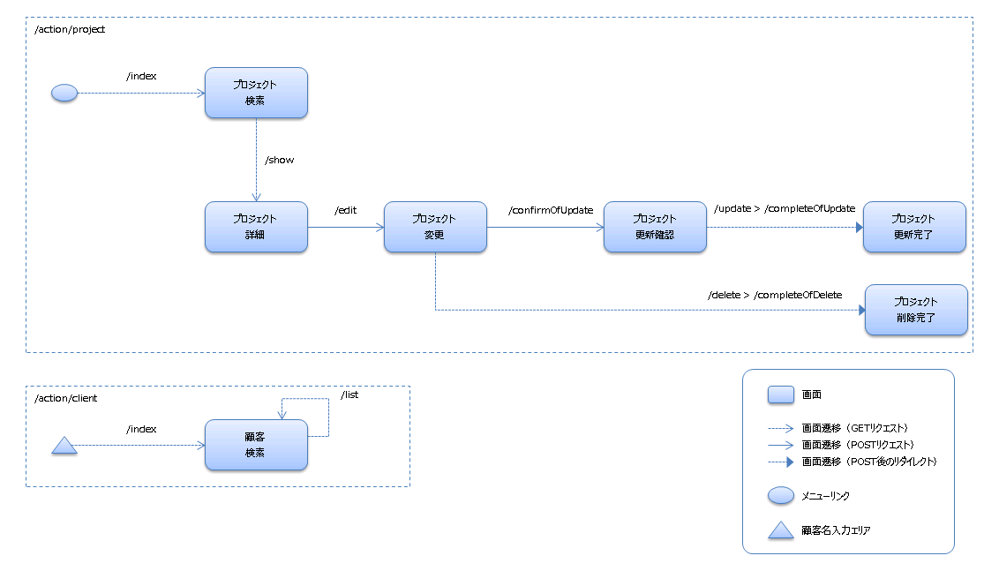
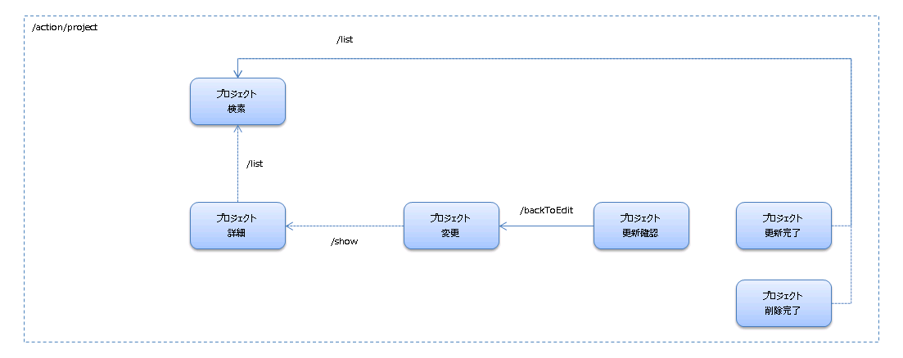
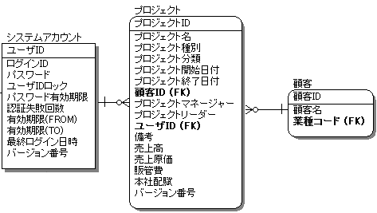

更新・削除画面を作ろう
==================================

## 演習内容
本エクササイズでは、マスタメンテでよく扱う更新処理及び削除処理の作り方を学習します。
  nablarch-example のプロジェクト変更機能を題材にします。

基本編では、入門編で学んだことを踏まえつつ、Nablarchの解説書を参照しながら機能を作りこんでいきます。

## 作成する機能について

プロジェクト変更(削除含む)機能を作成します。

## 演習を開始する為の準備

### 事前準備
本ハンズオンを開始する前にデータベースの作成及びエンティティクラスの生成を行っていない(以下のコマンドを実行していない)場合、チェックアウトディレクトリに移動し、以下のコマンドを実行してください。

    $cd entity
    $mvn clean install

### web プロジェクト起動
チェックアウトディレクトリに移動し、以下のコマンドを実行してください。その後、http://localhost:8082 にアクセスし、
  正常に「ログイン画面」が表示されることを確認してください。

    $cd handson-10
    $mvn clean compile
    $mvn waitt:run

## 演習内容に関するリファレンスマニュアル
本演習中に実装方法で不明な点が存在した場合は、以下のドキュメントを参照してください。

- 入門編で参照したドキュメント全般

### 解説書

#### Nablarchアプリケーションフレームワークの解説書
- 2.2. アプリケーションの責務配置
- 7.11.1. Bean Validation
	- データベースとの相関バリデーションを行う
		(2.2と7.11.1を読むことで、どの精査をFormで行い、どの精査をActionで行うかがわかります)

### APIドキュメント(アプリケーションプログラマ向け)
- UniversalDao
    (レコードの存在チェックに使用できるメソッドが記載されています)

## 実装内容
以下の機能を実装していきます。

- ユーザの入力を元に、既存のプロジェクトを更新する機能を実装してください。更新先のテーブルはPROJECTテーブルになります。
    入力項目については、提供するJSPを参照してください。
- ユーザが選択したプロジェクトを削除する機能を実装してください。PROJECTテーブルのレコードを物理削除します。

## 画面遷移
画面遷移は以下の通りにしてください。

### 画面遷移(戻り遷移は除く)

### 画面遷移(戻り遷移のみ)

## ER図
本エクササイズで使用するテーブルのER図です。

## 実装済みの箇所
###画面(Java側、JSP側双方含む)
以下の画面については実装済みです。

- プロジェクト検索
- 顧客検索

### Form、DTO
以下のFormやDTOは実装済みです。

- プロジェクト変更画面への遷移用Form([ProjectTargetForm](./src/main/java/com/nablarch/example/app/web/form/ProjectTargetForm.java))
- プロジェクト情報DTO([ProjectDto](./src/main/java/com/nablarch/example/app/web/dto/ProjectDto.java))
- プロジェクト変更画面用Form([ProjectForm](./src/main/java/com/nablarch/example/app/web/form/ProjectForm.java))

### JSPファイル
JSPファイルは実装済みです。以下のファイルを使用してください。

- プロジェクト変更画面([update.jsp](./src/main/webapp/WEB-INF/view/project/update.jsp))
- プロジェクト更新確認画面([confirmOfUpdate.jsp](./src/main/webapp/WEB-INF/view/project/confirmOfUpdate.jsp))
- プロジェクト更新完了画面([completeOfChange.jsp](./src/main/webapp/WEB-INF/view/project/completeOfChange.jsp))
- プロジェクト削除完了([completeOfChange.jsp](./src/main/webapp/WEB-INF/view/project/completeOfChange.jsp))

## 仕様について
### 画面間の連携に関する仕様
#### ログインユーザのIDについて
- ログインユーザのIDはセッションで保持しています。セッションへ登録する処理は、ログイン処理([AuthenticationAction#login](./src/main/java/com/nablarch/example/app/web/action/AuthenticationAction.java))で行っています。

#### 画面から送信される値及び、画面表示する値に関するFormやDTOの利用ルール
- 以下の値の連携は、Formを使用してください。
    - プロジェクト詳細画面([detail.jsp](./src/main/webapp/WEB-INF/view/project/detail.jsp))から、プロジェクト変更初期画面の表示処理([ProjectAction#edit](./src/main/java/com/nablarch/example/app/web/action/ProjectAction.java))へ送信された値の取り出しは、プロジェクト変更画面への遷移用Form([ProjectTargetForm](./src/main/java/com/nablarch/example/app/web/form/ProjectTargetForm.java))を使用してください。
    - プロジェクト変更画面([update.jsp](./src/main/webapp/WEB-INF/view/project/update.jsp))から、更新確認画面の表示処理([ProjectAction#confirmOfUpdate](./src/main/java/com/nablarch/example/app/web/action/ProjectAction.java))へ送信された値の取り出しは、プロジェクト変更画面用Form([ProjectForm](./src/main/java/com/nablarch/example/app/web/form/ProjectForm.java))を使用してください。

- 以下の値の連携は、DTOを使用してください。
    - プロジェクト変更画面([update.jsp](./src/main/webapp/WEB-INF/view/project/update.jsp))へ表示する値は、プロジェクト情報DTO([ProjectDto](./src/main/java/com/nablarch/example/app/web/dto/ProjectDto.java))を介して設定してください。

#### セッションを用いた値の連携を使用する箇所
以下の値の連携は、セッション上のProjectのエンティティを介して行ってください。セッションに登録する際のキー名は"project"としてください。

| 遷移元 | 遷移先 |
|:-------|:-------|
| プロジェクト更新確認画面([confirmOfUpdate.jsp](./src/main/webapp/WEB-INF/view/project/confirmOfUpdate.jsp)) （セッションへの値の登録自体は、更新確認画面表示処理([ProjectAction#confirmOfUpdate](./src/main/java/com/nablarch/example/app/web/action/ProjectAction.java))で実施）| 変更画面へ戻る処理([ProjectAction#backToEdit](./src/main/java/com/nablarch/example/app/web/action/ProjectAction.java)) |
| 同上 | 更新処理([ProjectAction#update](./src/main/java/com/nablarch/example/app/web/action/ProjectAction.java)) |
| プロジェクト変更画面([update.jsp](./src/main/webapp/WEB-INF/view/project/update.jsp)) （セッションへの値の登録自体は、更新初期画面表示処理([ProjectAction#edit](./src/main/java/com/nablarch/example/app/web/action/ProjectAction.java))で実施） | 削除処理([ProjectAction#delete](./src/main/java/com/nablarch/example/app/web/action/ProjectAction.java)) |

補足：セッションからの値に取り出しについては、[handson-04](../handson-04/README.md)と[handson-05](../handson-05)で登場しました。セッションへの値の登録については、APIドキュメント(アプリケーションプログラマ向け)を参照してください。

### システム全般で共通する仕様
#### DB更新(及び削除)を伴うリクエストのルール
- DB更新(及び削除)を伴うリクエストは以下のルールを守ってください。
    - 更新完了画面(及び削除完了画面)の表示について、リロードした際に値がPOSTされるのを防ぐために、リダイレクトを使用してください。
        表示にリダイレクトを使用する方法は、[handson-05](../handson-05)で登場しました。
    - 二重サブミット対策を実装してください。エラー時の遷移先はデフォルト(web-component-configuration.xmlで定義されています)とします。
        二重サブミット対策は、[handson-05](../handson-05)で登場しました。

#### トランザクション系テーブル(PROJECTテーブル)にUPDATEを行う際のルール
- トランザクション系テーブル(PROJECTテーブル)にUPDATEを行う際は、楽観ロックを使用してください。

#### プロジェクトのデータに関するルール
- 存在しない顧客に紐づくプロジェクトは作成してはいけません。チェックのルールは以下の通りとします。
    - 更新確認画面表示時のチェック
        - この場合は、業務例外として処理します。顧客テーブルに顧客IDが存在しない場合は、ApplicationExceptionを送出してください。ApplicationExceptionに設定するメッセージは、MessageUtil#createMessageで生成してください。パラメータは以下の通りです。
            - エラーレベル：MessageLevel.ERROR
            - メッセージID："errors.nothing.client"
            - メッセージの置換文字列1：顧客ID(文字列化して使用)
    - 更新画面へ戻る際のチェック
        - この場合は、システム例外として処理します（今回題材としているシステムには顧客の削除機能が存在しておらず、戻る遷移の際にデータが存在しないケースは通常存在しないため）。UniversalDao#findByIdが送出するNoDataExceptionをそのまま送出すればシステム例外として扱われます。
    - 補足：更新処理時に顧客テーブルに顧客IDが存在しない場合については、外部キー制約のエラーにより、システム例外が送出されます。

## 演習
では、更新処理及び削除処理を実装していきましょう。

### Java部分

#### 更新処理及び削除処理に共通する処理の実装内容

##### プロジェクト変更初期画面の表示処理([ProjectAction#edit](./src/main/java/com/nablarch/example/app/web/action/ProjectAction.java))
- 本メソッドには以下の処理を実装します。
    - Formに実装した入力値の精査処理の呼び出し。精査処理の呼び出し方法については、[handson-03](../handson-03)で登場しました。
    - 画面から受け取ったプロジェクトIDと、セッションから取り出したログインユーザのIDを元に、PROJECTテーブルを検索し、更新対象のエンティティを取得してください。
    - エンティティの値を設定した[ProjectDto](./src/main/java/com/nablarch/example/app/web/dto/ProjectDto.java)のインスタンスを用意してください。
    - 次画面の表示に使用するために、ProjectDtoをリクエストスコープに設定してください。キーは"form"です。
    - 更新対象のエンティティをセッションに登録してください。登録時の名前は、"project"としてください。このエンティティは画面間の値の受け渡しで使用します。
    - 正常終了時、プロジェクト変更画面([update.jsp](./src/main/webapp/WEB-INF/view/project/update.jsp))に遷移する処理を実装してください。

#### 更新処理に関する実装内容

##### 更新確認画面の表示処理([ProjectAction#confirmOfUpdate](./src/main/java/com/nablarch/example/app/web/action/ProjectAction.java))
- 本メソッドには以下の処理を実装します。
    - Formに実装した入力値の精査処理の呼び出し。
    - 入力精査エラー時の遷移先設定の実装。エラー発生時の遷移先はプロジェクト変更画面([update.jsp](./src/main/webapp/WEB-INF/view/project/update.jsp))にしてください。
    - Formの内容を、セッション中のProjectのエンティティ(ProjectAction#edit内で格納したもの)に設定してください。
    - 正常終了時、プロジェクト変更画面([confirmOfUpdate.jsp](./src/main/webapp/WEB-INF/view/project/confirmOfUpdate.jsp))に遷移する処理を実装してください。

##### 変更画面へ戻る処理([ProjectAction#backToEdit](./src/main/java/com/nablarch/example/app/web/action/ProjectAction.java))
- 本メソッドには以下の処理を実装します。
    - セッションの情報を元に、ProjectDtoを生成します。
    - 生成したProjectDtoを画面表示に使用するため、リクエストスコープに設定します。キーは"form"です。
    - 正常終了時、プロジェクト変更画面([update.jsp](./src/main/webapp/WEB-INF/view/project/update.jsp))に遷移する処理を実装してください。

##### 更新処理([ProjectAction#update](./src/main/java/com/nablarch/example/app/web/action/ProjectAction.java))
- 本メソッドには以下の処理を実装します。
    - PROJECTテーブルを更新します。
    - 更新処理と同時に不要になるセッション上のオブジェクトを削除します。
    - 正常終了時、更新完了画面を表示する処理([ProjectAction#completeOfUpdate](./src/main/java/com/nablarch/example/app/web/action/ProjectAction.java))に遷移する処理を実装してください。

##### 更新完了画面を表示する処理([ProjectAction#completeOfUpdate](./src/main/java/com/nablarch/example/app/web/action/ProjectAction.java))
- 本メソッドには以下の処理を実装します。
    - errorsタグに処理成功を示すメッセージを表示する処理を実装してください。
        - 表示のためには、WebUtil#notifyMessagesを使用します。
          WebUtil#notifyMessagesの第2引数は、MessageUtil#createMessageを使用して生成してください。MessageUtil#createMessageに設定する引数は以下の通りです。
            - メッセージレベル：MessageLevel#INFO
            - メッセージID：success.update.project

#### 削除処理に関する実装内容

##### 削除処理([ProjectAction#delete](./src/main/java/com/nablarch/example/app/web/action/ProjectAction.java))
- 本メソッドには以下の処理を実装します。
    - PROJECTテーブルからレコードを1件削除します。削除対象は、セッションから"project"という名前で取り出したProjectオブジェクトに格納されているプロジェクトIDのレコードです。
    - 正常終了時、削除完了画面の表示処理([ProjectAction#completeOfDelete](./src/main/java/com/nablarch/example/app/web/action/ProjectAction.java))に遷移する処理を実装してください。

##### 削除完了画面の表示処理([ProjectAction#completeOfDelete](./src/main/java/com/nablarch/example/app/web/action/ProjectAction.java))
- 本メソッドには以下の処理を実装します。
    - errorsタグに処理成功を示すメッセージを表示する処理を実装してください。
        - 表示のためには、WebUtil#notifyMessagesを使用します。
          WebUtil#notifyMessagesの第2引数は、MessageUtil#createMessageを使用して生成してください。MessageUtil#createMessageに設定する引数は以下の通りです。
            - メッセージレベル：MessageLevel#INFO
            - メッセージID：success.delete.project
    - 正常終了時、プロジェクト削除完了([completeOfChange.jsp](./src/main/webapp/WEB-INF/view/project/completeOfChange.jsp))に遷移する処理を実装してください。

## 動作確認方法
exercise-10 を起動後以下を行います。

### 更新処理の動作確認
1. http://localhost:8082 にアクセスします。
2. ログインします。
3. プロジェクト検索一覧画面が表示されるので、検索ボタンをクリックします。
4. 検索結果が表示されるので、プロジェクトID列のリンクをクリックします。
5. プロジェクト詳細画面に遷移し、クリックした行の情報が表示されます。
6. 変更ボタンをクリックします。
7. 必須項目を消し、更新ボタンをクリックした際、エラーが表示されることを確認します。
8. 全ての項目を適切に入力して更新ボタンをクリックした際、プロジェクト更新確認画面(入力した値が表示されている画面)が表示されることを確認してください。
9. 入力へ戻るボタンをクリックすると、プロジェクト変更画面が表示されることを確認してください。
10. 更新ボタンをクリックすると、プロジェクト更新確認画面が表示されることを確認してください。
11. 確定ボタンをクリックすると、プロジェクト更新完了画面が表示されることを確認してください。

### 削除処理の動作確認
1. 更新処理の動作確認の項番6まで進めます。
2. 削除ボタンをクリックします。
3. プロジェクト変更完了画面が表示されますので、次へをクリックします。
4. プロジェクト検索一覧画面に、削除したプロジェクトが表示されないことを確認します。

※ログイン時に利用できるユーザは以下です。

| ログインID | パスワード |
|:-------- |:---------|
| 10000001 | pass123- |

## 解答例について
解答例は、[nablarch-handson-app-web](../nablarch-handson-app-web)を参照してください。
