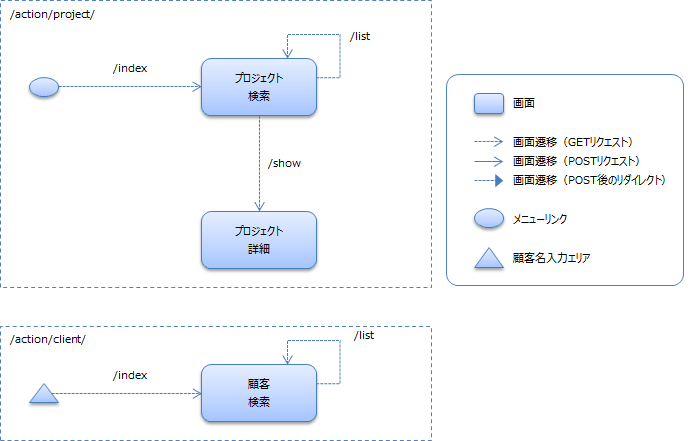
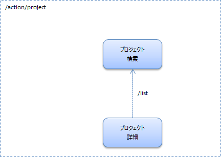

検索画面と照会画面を作ろう
==================================

## 演習内容
本エクササイズでは、マスタメンテでよく扱う検索機能と照会機能の作り方を学習します。
  nablarch-example のプロジェクト検索機能と詳細機能を題材にします。

基本編では、入門編で学んだことを踏まえつつ、Nablarchの解説書を参照しながら機能を作りこんでいきます。

## 作成する機能について

プロジェクト検索(一覧検索機能)と、プロジェクト照会(プロジェクト1件の詳細表示機能)を作成します。

## 演習を開始する為の準備

### 事前準備
本ハンズオンを開始する前にデータベースの作成及びエンティティクラスの生成を行っていない(以下のコマンドを実行していない)場合、チェックアウトディレクトリに移動し、以下のコマンドを実行してください。

    $cd entity
    $mvn clean install

### web プロジェクト起動
チェックアウトディレクトリに移動し、以下のコマンドを実行してください。その後、http://localhost:8082 にアクセスし、
  正常に「ログイン画面」が表示されることを確認してください。

    $cd handson-10
    $mvn clean compile
    $mvn waitt:run

## 演習内容に関するリファレンスマニュアル
本演習中に実装方法で不明な点が存在した場合は、以下のドキュメントを参照してください。

- 入門編で参照したドキュメント全般

### 解説書

#### Nablarchアプリケーションフレームワークの解説書
- 7.4.1. データベースアクセス(JDBCラッパー)
	- Beanオブジェクトを入力としてSQLを実行する
- 7.19. JSPカスタムタグ
	- 使用方法
		- タグリファレンス(使用方法「ちなみに」内リンク)

#### Nablarch実装例集の解説書
- 検索結果の一覧表示
	- listSearchResultタグ
		- listSearchResultタグの主要な属性
		- 検索結果

## 実装する機能
以下の機能を実装してください。

- ユーザの入力を元に、プロジェクトを検索する機能を実装してください。検索先のテーブルはPROJECTテーブルです。
  	入力項目については、提供するJSPを参照してください。
- プロジェクトの詳細を表示する機能を実装してください。

## 画面遷移
画面遷移は以下の通りにしてください。

### 画面遷移(戻り遷移は除く)

### 画面遷移(戻り遷移のみ)

## 実装済みの箇所
###画面(Java側、JSP側双方含む)
以下の画面については実装済みです。

- 顧客検索

### Form、DTO
以下のFormやDTOは実装済みです。

- プロジェクト検索一覧フォーム([ProjectSearchForm](./src/main/java/com/nablarch/example/app/web/form/ProjectSearchForm.java))
- プロジェクト検索条件DTO([ProjectSearchDto](./src/main/java/com/nablarch/example/app/web/dto/ProjectSearchDto.java))
- プロジェクト詳細画面への遷移用フォーム([ProjectTargetForm](./src/main/java/com/nablarch/example/app/web/form/ProjectTargetForm.java))
- プロジェクト情報DTO([ProjectDto](./src/main/java/com/nablarch/example/app/web/dto/ProjectDto.java))

### JSPファイル
以下のJSPファイルは実装済みです。

- プロジェクト詳細画面([detail.jsp](./src/main/webapp/WEB-INF/view/project/detail.jsp))

## 仕様について
### 画面間の連携に関する仕様
#### 画面から送信される値及び、画面表示する値に関するDTOの利用ルール
- 以下の値の連携は、Formを使用して連携してください。
	- プロジェクト検索一覧画面([index.jsp](./src/main/webapp/WEB-INF/view/project/index.jsp))から、プロジェクト詳細画面の表示処理([ProjectAction#show](./src/main/java/com/nablarch/example/app/web/action/ProjectAction.java))へ送信された値の取り出しは、プロジェクト詳細画面への遷移用Form([ProjectTargetForm](./src/main/java/com/nablarch/example/app/web/form/ProjectTargetForm.java))を使用してください。

- 以下の値の連携は、DTOを使用して連携してください。
    - プロジェクト詳細画面([detail.jsp](./src/main/webapp/WEB-INF/view/project/detail.jsp))へ表示する値は、プロジェクト情報DTO([ProjectDto](./src/main/java/com/nablarch/example/app/web/dto/ProjectDto.java))を介して設定してください。

## 演習
では、検索機能と照会機能を実装していきましょう。

### JSP部分
#### 検索に関する部分
##### プロジェクト検索結果表示部分([index.jsp](./src/main/webapp/WEB-INF/view/project/index.jsp))
- 152行目付近の<tr class="info"> タグの中を記述してください。各行の値はProjectクラスに格納されています。
  下表の項目を出力するように実装します。

|プロパティ名      | 説明 |
|:-----------------|:-----|
| projectId        | プロジェクトIDをリンクで表示してください。リンクの遷移先は、プロジェクト詳細画面です。パスの最後を「show/プロジェクトID」とすることでProjectAction#showメソッドにプロジェクトIDがパラメータとして渡ります。 |
| projectName      | プロジェクト名をそのまま表示してください。 |
| projectType      | 値に対応するコード名称を表示してください。コードは、[ProjectType](./src/main/java/com/nablarch/example/app/web/common/code/ProjectType.java)列挙型に定義されています。|
| projectStartDate | yyyy/MM/ddの書式で表示してください。書式の変換はカスタムタグの機能を使用してください。データタイプは、「exampleDateTime」を指定してください。 |
| projectEndDate   | 同上の表示を行ってください。 |

### Java部分

#### 検索処理に関する実装内容

##### 検索一覧初期画面表示([ProjectAction#index](./src/main/java/com/nablarch/example/app/web/action/ProjectAction.java))
- 本メソッドには以下の処理を実装します。
	- 初期表示時点での検索条件として以下を設定し、リクエストスコープにキー名「searchForm」で設定してください。
    	- ソートキーとして"NAME"を設定してください。ソートキーは、[ProjectSortKey](./src/main/java/com/nablarch/example/app/web/common/code/ProjectSortKey.java)列挙型に定義されています。
    	- 並び順として"ASC"を設定してください。ソートキーは、[SortOrder](./src/main/java/com/nablarch/example/app/web/common/code/SortOrder.java)列挙型に定義されています。
		- ページ番号として1ページを設定してください。
	- 検索を実行([ProjectAction#searchProject](./src/main/java/com/nablarch/example/app/web/action/ProjectAction.java)メソッドを呼び出す)し、結果をリクエストスコープに設定してください。設定に使用する名前は、[index.jsp](./src/main/webapp/WEB-INF/view/project/index.jsp)を参照してください。
    - プロジェクト検索一覧画面([index.jsp](./src/main/webapp/WEB-INF/view/project/index.jsp))に遷移する処理を実装してください。

##### 検索結果表示([ProjectAction#list](./src/main/java/com/nablarch/example/app/web/action/ProjectAction.java))
- 本メソッドには以下の処理を実装します。
    - Formに実装した入力値の精査処理の呼び出しと入力精査エラー時の遷移先設定の実装。遷移先はプロジェクト検索一覧画面にしてください。精査処理の呼び出し方法については、[handson-03](../handson-03/README.md)で登場しました。
	- 検索を実行([ProjectAction#searchProject](./src/main/java/com/nablarch/example/app/web/action/ProjectAction.java)メソッドを呼び出す)し、結果をリクエストスコープに設定してください。設定に使用する名前は、[index.jsp](./src/main/webapp/WEB-INF/view/project/index.jsp)を参照してください。
    - プロジェクト検索一覧画面([index.jsp](./src/main/webapp/WEB-INF/view/project/index.jsp))に遷移する処理を実装してください。

##### 検索([ProjectAction#searchProject](./src/main/java/com/nablarch/example/app/web/action/ProjectAction.java))
- 本メソッドには以下の処理を実装します。
	- LoginUserPrincipalをセッションから取得し、本メソッドの引数のsearchConditionにユーザーIDを設定してください。
    - PROJECTテーブルを検索してください。検索は以下のように実装してください。
        - 検索に使用するSQL IDは、SEARCH_PROJECTとしてください。
        - ページング有りの検索とし、1ページ辺りは20件としてください。

#### 詳細画面表示に関する実装内容

##### プロジェクト詳細画面の表示処理([ProjectAction#show](./src/main/java/com/nablarch/example/app/web/action/ProjectAction.java))
- 本メソッドには以下の処理を実装します。
    - Formに実装した入力値の精査処理の呼び出し。直接ユーザが入力する値は有りませんが、プロジェクトIDが画面から送信されてくるため、精査が必要です。
    - プロジェクトIDと、セッションから取得したログインユーザのIDを元に、PROJECTテーブルから値を取得してください。SQL_IDは、"FIND_BY_PROJECT_ID"です。
    - 検索結果をリクエストスコープに設定してください。
    - 正常終了時、プロジェクト詳細画面([detail.jsp](./src/main/webapp/WEB-INF/view/project/detail.jsp))に遷移する処理を実装してください。

### SQL部分

#### 検索処理に関する実装内容

##### 一覧検索用SQL([Project.sql](./src/main/resources/com/nablarch/example/app/entity/Project.sql))
- SQL IDは、SEARCH_PROJECTとしてください。
- 取得対象のテーブルはPROJECTテーブルです。
- 取得対象のカラムは以下の通りです。
    - PROJECT_ID
    - PROJECT_NAME
    - PROJECT_TYPE
    - PROJECT_CLASS
    - PROJECT_START_DATE
    - PROJECT_END_DATE
    - VERSION
- 以下の項目は必須の検索条件です。
    - USER_ID … 完全一致。ログインしているユーザのユーザID
- 以下の項目は、画面から入力があった項目について、検索条件として使用できるように実装してください。条件は全てANDで結合してください。
    - CLIENT_ID …完全一致検索
    - PROJECT_NAME … 部分一致検索
    - PROJECT_TYPE … 完全一致検索
    - PROJECT_CLASS … IN句を使用した検索(画面から複数入力可)
    - PROJECT_START_DATE … 範囲指定検索(画面から期間を入力する)
    - PROJECT_END_DATE … 範囲指定検索(画面から期間を入力する)
- 以下のいずれかの条件でソートできるように実装してください。
  (どの条件でソートするかはProjectSearchDto#getSortId()の値で決定する)
    - 第1キー：PROJECT_ID 昇順
    - 第1キー：PROJECT_ID 降順
    - 第1キー：PROJECT_NAME 昇順　　第2キー：PROJECT_ID 昇順
    - 第1キー：PROJECT_NAME 降順　　第2キー：PROJECT_ID 降順
    - 第1キー：PROJECT_START_DATE 昇順　　第2キー：PROJECT_ID 昇順
    - 第1キー：PROJECT_START_DATE 降順　　第2キー：PROJECT_ID 降順
    - 第1キー：PROJECT_END_DATE 昇順　　第2キー：PROJECT_END_DATE 昇順
    - 第1キー：PROJECT_END_DATE 降順　　第2キー：PROJECT_END_DATE 降順

## 動作確認方法
handson-11 を起動後以下を行います。

### 検索処理の確認方法
1. http://localhost:8082 にアクセスします。
2. ログインします。
3. 検索結果の右上に存在するソート順が、「プロジェクト名」「昇順」になっていることを確認してください。
   (なっていない場合は、ログインからやり直してみてください)
6. 1画面に20件の検索結果が表示されることを確認してください。
7. 検索条件を入力し検索ボタンをクリックすると、検索条件に応じた検索結果に絞り込まれることを確認します。
8. 検索結果の右上に存在するソート順を変更すると、表示順序が変わることを確認します。
9. 検索結果のプロジェクトIDのリンクをクリックするとプロジェクト詳細画面に遷移することを確認してください。

### 照会処理の確認方法
1. http://localhost:8082 にアクセスします。
2. ログインします。
3. プロジェクト検索一覧画面が表示されるので、プロジェクトID列のリンクをクリックします。
5. プロジェクト詳細画面に遷移し、クリックした行の情報が表示されます。

※ログイン時に利用できるユーザは以下です。

| ログインID | パスワード |
|:-------- |:---------|
| 10000001 | pass123- |

## 解答例について
解答例は、[nablarch-handson-app-web](../nablarch-handson-app-web/README.md)を参照してください。
